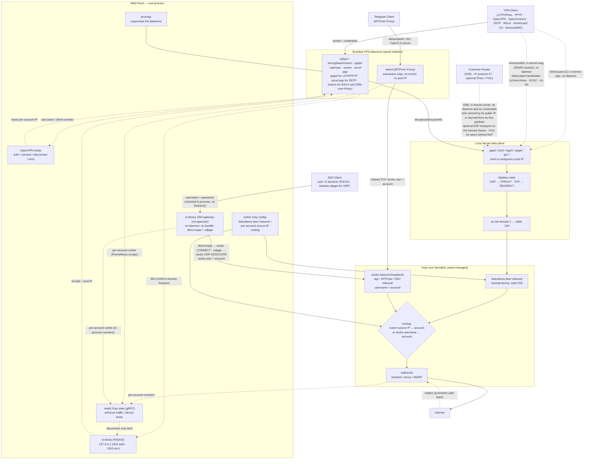
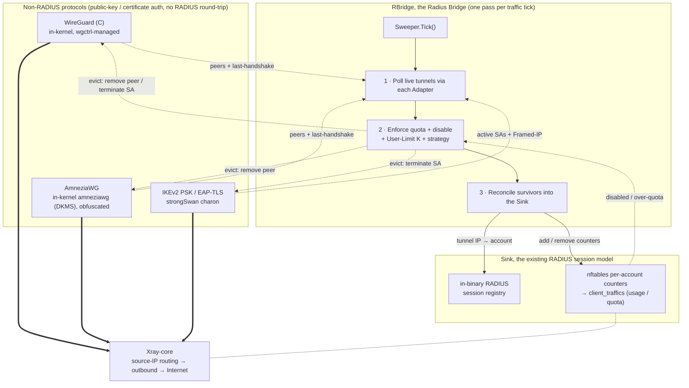

[English](/README.md) | [فارسی](/README_FA.md)

<p align="center">
  <a href="https://github.com/infowild/Wild-Panel">
    
  </a>
</p>

<p align="center">
  <sub>Overview — live traffic, host status, and service health.</sub>
</p>

<p align="center">
  <b>Wild Panel</b> — all-in-one VPN control panel: glass UI, multi-protocol cores, Xray routing, resellers, groups, and remote nodes.
</p>

<p align="center">
  
  
  
</p>

**Wild Panel** is a control panel for operators who need wide protocol coverage and a monitoring UI that stays readable. It is built on **[3X-UI](https://github.com/MHSanaei/3x-ui)** with a redesigned glass interface (dark and light), API tokens for sales bots, client groups, reseller balances, remote node sync, and a single self-contained Linux binary.

<p align="center">
  
</p>

<p align="center">
  <sub>Sign-in — glass neon UI, dark by default, light theme available.</sub>
</p>

## Highlights

- Glass UI (cyan + violet) on dark and light themes, usable on phone and desktop
- One binary: geofiles, patched Xray-core, and VPN daemons embedded
- Bearer **API tokens** for bots and scripts (Settings → Security)
- Multi-admin permissions, **resellers** with a traffic wallet, **client groups**, **remote nodes**
- SQLite **backup / restore** (this panel or a 3x-ui database), Telegram backups
- Subscriptions, 2FA, Telegram bot, in-panel update, Let's Encrypt (including a bare public IP)

## Protocols

Dial-in / tunnel cores the panel runs (or kernel-offloads):

- PPTP
- L2TP (RAW)
- L2TP/IPsec
- OpenVPN (TCP and UDP, downloadable `.ovpn`)
- OpenConnect (cisco)
- SSTP
- IKEv2
- WireGuard (C)
- AmneziaWG (obfuscated WireGuard)
- GRE (site-to-site, optional IPsec / FOU)
- MTProto Proxy (Telegram)
- SSH (in-process gateway, no extra daemon)

Plus three protocols in the patched Xray-core, as **inbounds and outbounds**:

- AnyTLS
- TUIC (v5)
- NaiveProxy

Stock Xray protocols (VLESS, VMess, Trojan, Shadowsocks, WireGuard, and the rest of the 3x-ui set) are included as well.

## Features

**Accounts and inbounds**

- Per-account traffic, expiry, speed limits, device / IP limits, freeze
- **Client groups** — label clients, bulk add/remove, group traffic view
- Client-to-client and **cross-inbound** (for example L2TP talking to OpenVPN)
- Bulk ops: traffic, days, enable/disable, delete, freeze, inbound delete
- TXT / PDF export of links; OpenVPN / WireGuard / AmneziaWG / GRE / SSH config downloads (panel and subscription page)
- AES-256-GCM and AES-128-GCM on Shadowsocks; **XHTTP** on inbound and outbound

**Operators**

- **Admins** with a permission mask and per-inbound grants
- **Resellers** with a GB balance, min create/top-up, optional days-per-GB, assigned inbounds only — they see and can delete **only the clients they created**
- **Nodes** — mirror inbounds to another Wild Panel / 3x-ui over an API token, probe health, aggregate traffic
- Telegram bot (status, backups, client actions)
- LDAP sync (optional)

**Panel**

- Overview, inbounds, groups, nodes, settings, Xray template, core catalog
- In-panel update from GitHub, a local binary, or a URL (DB snapshot first)
- Database export, like-for-like restore, import of a foreign 3x-ui DB (this panel’s listen/TLS/secret kept)
- WARP-CLI install helper ([warp-cli](https://github.com/Sir-MmD/warp-cli))
- Real TLS for a hostname **or a bare server IP** (Let’s Encrypt); renewals apply without restarting the panel
- Patched [Xray-core](https://github.com/Sir-MmD/Xray-core): Shadowsocks cipher fix, AnyTLS / TUIC / NaiveProxy as first-class protocols (traffic, speed and device limits follow)

## Tested operating systems

| | Distribution | Version | Version |
|:---:|:---|:---:|:---:|
|  | **Ubuntu** | `24.04` | `26.04` |
|  | **Debian** | `12` | `13` |
|  | **Fedora** | `43` | `44` |
|  | **AlmaLinux** | `9` | `10` |
|  | **Rocky Linux** | `9` | `10` |
|  | **CentOS Stream** | `9` | `10` |
|  | **Arch Linux** | `Rolling` | |

> [!IMPORTANT]
> Install on a tested distribution. Bundled VPN cores are built and verified there; other OS images often fail in subtle ways.

> [!NOTE]
> **AmneziaWG runs on Debian 12/13 and Ubuntu 24.04/26.04 only.**
> Unlike the other protocols, AmneziaWG is not in any distro kernel: the panel compiles its module on the host. That module currently fails on **kernel 7.1+** (Fedora 43/44, Arch — `ipv6_stub` removed) and on **AlmaLinux / Rocky / CentOS Stream** (RHEL backport / EL10). Those are upstream AmneziaWG limits. Setup reports the miss instead of failing silently. **Every other protocol works on all tested OS images.**

## Install

```bash
curl -Ls https://raw.githubusercontent.com/infowild/Wild-Panel/refs/heads/main/deploy.sh | sudo bash
```

The installer puts the binary and database under `/opt/wild-panel`, installs the `wild-panel` systemd unit, and the `wild-panel` menu on `$PATH`. An older `/opt/vpn-ui` install is migrated on upgrade.

Offline install (skip GitHub):

```bash
sudo LOCAL_BIN=/path/to/wild-panel-amd64 bash deploy.sh
```

After install, `sudo wild-panel` opens the management menu (port, path, SSL, update, uninstall).

## Uninstall

```bash
sudo wild-panel uninstall --yes
```

Equivalent:

```bash
sudo /opt/wild-panel/wild-panel-amd64 --uninstall --yes
```

Without `--yes` you must type `yes`. Uninstall stops the unit, closes the database, and removes `/opt/wild-panel` (and leftover `/opt/vpn-ui` if present).

Latest numbered release: [GitHub Releases](https://github.com/infowild/Wild-Panel/releases).

## How the new protocols interact with Xray-core



## How RBridge handles non-RADIUS protocols

WireGuard (C), AmneziaWG and IKEv2 **PSK** / **EAP-TLS** authenticate with a key or certificate, so they never hit RADIUS. Alone they would have no session, no traffic counters, and no **User Limit**. **RBridge** fills that: each traffic tick it polls live tunnels, enforces quota / disable / User Limit K, then writes survivors into the same in-binary RADIUS registry and nftables accounting the RADIUS protocols use. Egress is still Xray **dokodemo-door**.

For **WireGuard (C)** and **AmneziaWG**, User Limit K means K device slots: K keypairs, K configs, K tunnel IPs — phone, laptop, and router on one account without fighting over a single key.



## Building from source

Needs Linux, Go (see `go.mod`), CGO, gcc, and the bundled core/daemon build scripts:

```bash
git clone https://github.com/infowild/Wild-Panel.git && cd Wild-Panel
./build.sh
```

## E2E testing


Python E2E suite in `test_unit`:

1. Edit `test_unit/config.toml`.
2. Run `setup.sh`.
3. Put the compiled binary in `test_subject`.
4. Run `run.sh` with `sudo`.

> [!IMPORTANT]
> A full run is slow. For a small change, use `--tests`:

| Test ID | Description |
| :--- | :--- |
| `core-init` | provision kernel modules + packages + xray core |
| `server-setup` | create inbounds + accounts + source-IP routing rules |
| `openvpn` | connect variants + checks + peer reachability (OpenVPN) |
| `l2tp` | connect variants + checks + peer reachability (L2TP/IPsec) |
| `pptp` | connect variants + checks + peer reachability (PPTP) |
| `openconnect` | connect variants + checks + peer reachability + same-NAT user-limit (OpenConnect/ocserv) |
| `sstp` | connect variants + checks + peer reachability (SSTP/accel-ppp, PPP-over-TLS) |
| `ikev2` | connect + checks + peer reachability (IKEv2/IPsec, strongSwan charon; eap-mschapv2 + psk + eap-tls) |
| `wg-c` | connect + checks + peer reachability + per-account usage/termination (WireGuard C, in-kernel wgctrl, gateway /29, + preshared-key mode) |
| `awg` | connect + checks + peer reachability + per-account usage/termination (AmneziaWG, in-kernel amneziawg DKMS module, obfuscation params, + preshared-key mode) |
| `gre` | connect + checks + peer reachability + per-account usage/termination (GRE site-to-site, in-kernel ip_gre; raw / IPsec / FOU peer modes, static and dynamic peers) |
| `mtproto` | alias: runs every MTProto phase below (MTProto Proxy, telemt) |
| `mtproto-classic` | handshake + relay to a real Telegram DC + wrong-secret control + usage (obfuscated2) |
| `mtproto-secure` | same, "dd" random-padding secret |
| `mtproto-tls` | same + FakeTLS ServerHello HMAC verified, "ee" secret |
| `mtproto-toggle` | editing an account's modes takes effect on the RUNNING daemon (no restart) |
| `mtproto-termination` | quota auto-disables the account AND the proxy stops relaying for it |
| `mtproto-adtag` | an ad tag forces middle-proxy egress and drops the inbound's Xray routing, and clearing it restores both |
| `ssh` | connect + checks + routing + user-limit + both strategies + per-account usage/termination (SSH relay, in-binary Go gateway) |
| `ssh-udp` | UDP through the relay: udpgw terminated in-process and bridged to Xray via SOCKS5 UDP ASSOCIATE, plus accounting |
| `bulk-ops` | bulk client add/sub/enable/disable + TXT/PDF export via API |
| `backup-restore` | DB export + import round-trip |
| `warp-socks` | Cloudflare warp-cli SOCKS install + egress |
| `random-cfg` | `--random` switch: randomize port + creds + webpath, then restore |
| `systemd` | `--systemd` switch: install + run the panel as a systemd unit |
| `uninstall` | `--uninstall` switch: install everything, tear down, assert clean host |
| `export-js` | host-side Node TXT/PDF export test (no VM) |

One OS image:

```bash
sudo ./run.sh --only ubuntu-24
```

## Donate

Donation addresses will be added here later.
