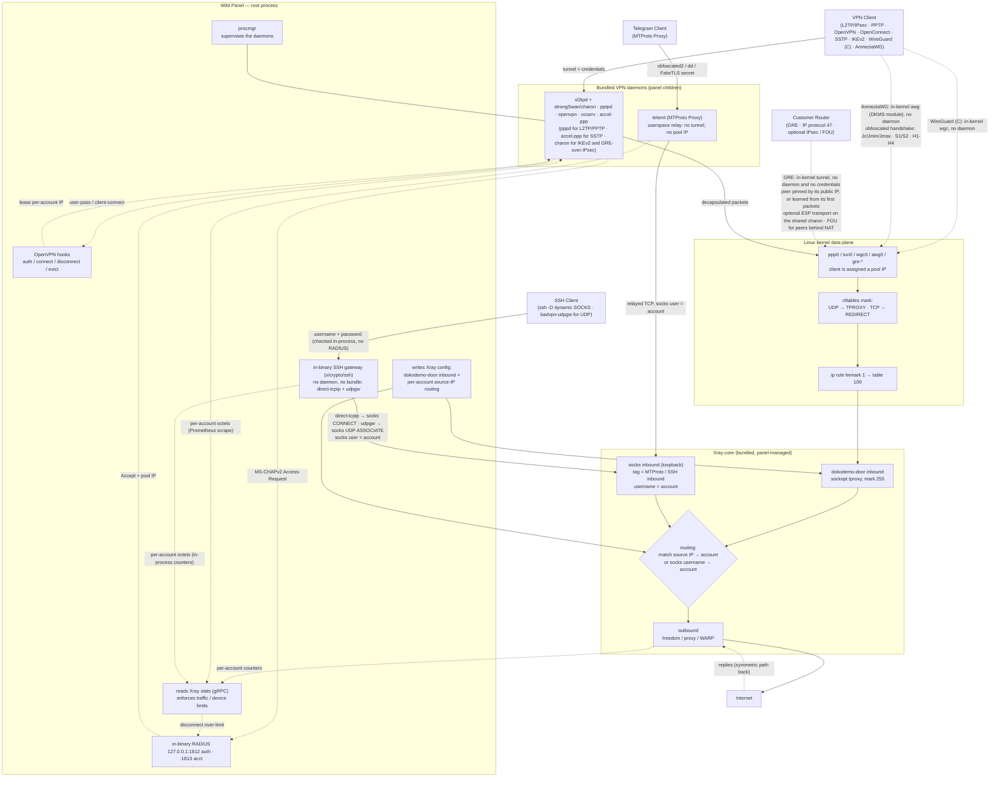
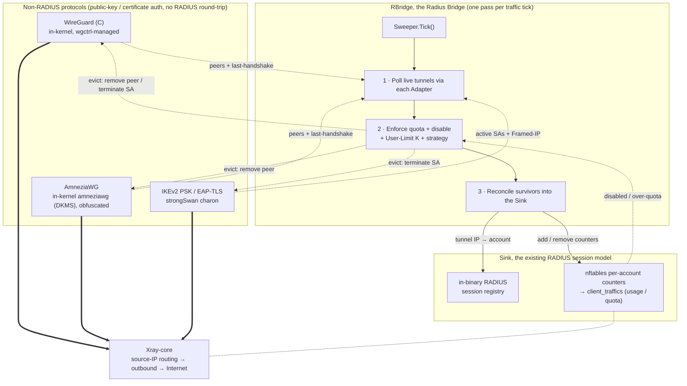

[English](/README.md) | [فارسی](/README_FA.md)

<p align="center">
  <a href="https://github.com/infowild/Wild-Panel">
    
  </a>
</p>

<p align="center">
  <sub>داشبورد — ترافیک زنده، وضعیت سرور و سلامت سرویس‌ها.</sub>
</p>

<p align="center">
  <b>Wild Panel</b> — پنل همه‌کارهٔ VPN: رابط شیشه‌ای، هسته‌های چندپروتکلی، مسیریابی Xray، نماینده، گروه‌ها و نودهای ریموت.
</p>

<p align="center">
  
  
  
</p>

**Wild Panel** پنل کنترل برای اپراتوری است که هم پوشش پروتکل می‌خواهد و هم مانیتورینگ خوانا. بر پایهٔ **[3X-UI](https://github.com/MHSanaei/3x-ui)** است، با UI شیشه‌ای (تاریک و روشن)، توکن API برای ربات فروش، گروه‌بندی کلاینت، اعتبار نماینده، همگام‌سازی نود ریموت، و یک باینری لینوکس خودکفا.

<p align="center">
  
</p>

<p align="center">
  <sub>ورود — رابط شیشه‌ای نئون، پیش‌فرض تیره، تم روشن هم هست.</sub>
</p>

## نکات برجسته

- UI شیشه‌ای (فیروزه‌ای + بنفش) در تم تاریک و روشن، موبایل و دسکتاپ
- یک باینری: Geofile، Xray-core پچ‌شده و دیمون‌های VPN داخلش
- **توکن API** برای ربات و اسکریپت (Settings → Security)
- چند مدیر با مجوز، **نماینده** با کیف ترافیک، **گروه کلاینت**، **نود ریموت**
- **بکاپ / ریستور** SQLite (همین پنل یا دیتابیس 3x-ui)، بکاپ تلگرام
- اشتراک، 2FA، ربات تلگرام، آپدیت از داخل پنل، Let's Encrypt (حتی روی IP خالی)

## پروتکل‌ها

هسته‌های تونل / دایال‌این که پنل اجرا یا به کرنل می‌سپارد:

- PPTP
- L2TP (RAW)
- L2TP/IPsec
- OpenVPN (TCP و UDP، فایل `.ovpn`)
- OpenConnect (cisco)
- SSTP
- IKEv2
- WireGuard (C)
- AmneziaWG (WireGuard مبهم‌سازی‌شده)
- GRE (site-to-site، در صورت نیاز IPsec / FOU)
- MTProto Proxy (تلگرام)
- SSH (گیت‌وی داخل خود پنل، بدون دیمون جدا)

سه پروتکل داخل Xray-core پچ‌شده، هم **اینباند** هم **اوت‌باند**:

- AnyTLS
- TUIC (v5)
- NaiveProxy

پروتکل‌های معمولی Xray (VLESS، VMess، Trojan، Shadowsocks، WireGuard و بقیهٔ مجموعهٔ 3x-ui) هم هستند.

## امکانات

**اکانت و اینباند**

- ترافیک، انقضا، محدودیت سرعت، محدودیت دستگاه / IP، فریز
- **گروه کلاینت** — برچسب، افزودن/حذف گروهی، مشاهدهٔ ترافیک گروه
- Client-to-client و **Cross Inbound** (مثلاً L2TP به OpenVPN)
- عملیات گروهی: حجم، روز، فعال/غیرفعال، حذف، فریز، حذف اینباند
- خروجی TXT / PDF لینک‌ها؛ دانلود کانفیگ OpenVPN / WireGuard / AmneziaWG / GRE / SSH (پنل و صفحهٔ اشتراک)
- AES-256-GCM و AES-128-GCM روی Shadowsocks؛ **XHTTP** در اینباند و اوت‌باند

**اپراتور**

- **ادمین** با ماسک مجوز و دسترسی اینباند
- **نماینده** با اعتبار GB، حداقل ساخت/شارژ، اختیاری روز-به‌ازای-گیگ، فقط اینباندهای داده‌شده — فقط **اکانت‌هایی که خودش ساخته** را می‌بیند و می‌تواند حذف کند
- **نود** — آینهٔ اینباند روی پنل ریموت (Wild Panel / 3x-ui) با توکن API، تست اتصال، جمع ترافیک
- ربات تلگرام (وضعیت، بکاپ، اکشن کلاینت)
- همگام‌سازی LDAP (اختیاری)

**پنل**

- Overview، اینباندها، گروه‌ها، نودها، تنظیمات، قالب Xray، کاتالوگ هسته
- آپدیت از GitHub، فایل محلی یا URL (اول اسنپ‌شات دیتابیس)
- خروجی دیتابیس، ریستور مثل‌به‌مثل، ورود دیتابیس خارجی 3x-ui (آدرس/TLS/سکرت همین پنل حفظ می‌شود)
- کمک نصب WARP-CLI ([warp-cli](https://github.com/Sir-MmD/warp-cli))
- TLS واقعی برای دامنه **یا IP خالی سرور** (Let's Encrypt)؛ تمدید گواهی بدون ری‌استارت پنل
- [Xray-core پچ‌شده](https://github.com/Sir-MmD/Xray-core): رفع cipher شادوساکس، AnyTLS / TUIC / NaiveProxy به‌صورت پروتکل درجه یک

## سیستم‌عامل‌های تست‌شده

| | توزیع | نسخه | نسخه |
|:---:|:---|:---:|:---:|
|  | **Ubuntu** | `24.04` | `26.04` |
|  | **Debian** | `12` | `13` |
|  | **Fedora** | `43` | `44` |
|  | **AlmaLinux** | `9` | `10` |
|  | **Rocky Linux** | `9` | `10` |
|  | **CentOS Stream** | `9` | `10` |
|  | **Arch Linux** | `Rolling` | |

> [!IMPORTANT]
> پنل را روی توزیع تست‌شده نصب کنید. هسته‌های باندل‌شده آنجا ساخته و بررسی شده‌اند؛ روی سیستم‌عامل دیگر معمولاً مشکل ریز پیش می‌آید.

> [!NOTE]
> **AmneziaWG فقط روی Debian 12/13 و Ubuntu 24.04/26.04 کار می‌کند.**
> برخلاف بقیه، در کرنل هیچ توزیعی نیست: پنل ماژول را روی خود سرور کامپایل می‌کند. فعلاً روی **کرنل 7.1 به بالا** (Fedora 43/44 و Arch — حذف `ipv6_stub`) و روی **AlmaLinux / Rocky / CentOS Stream** بیلد نمی‌شود. محدودیت خودِ AmneziaWG است. نصب به‌جای شکست خاموش، گزارش می‌دهد. **بقیهٔ پروتکل‌ها روی همهٔ OSهای تست‌شده کار می‌کنند.**

## نصب

```bash
curl -Ls https://raw.githubusercontent.com/infowild/Wild-Panel/refs/heads/main/deploy.sh | sudo bash
```

نصب‌کننده باینری و دیتابیس را در `/opt/wild-panel` می‌گذارد، یونیت systemd به نام `wild-panel` و منوی `wild-panel` روی `$PATH`. نصب قدیمی `/opt/vpn-ui` هنگام ارتقا منتقل می‌شود.

نصب آفلاین (بدون GitHub):

```bash
sudo LOCAL_BIN=/path/to/wild-panel-amd64 bash deploy.sh
```

بعد از نصب، `sudo wild-panel` منوی مدیریت را باز می‌کند (پورت، مسیر، SSL، آپدیت، حذف).

## حذف پنل

```bash
sudo wild-panel uninstall --yes
```

معادل:

```bash
sudo /opt/wild-panel/wild-panel-amd64 --uninstall --yes
```

بدون `--yes` باید `yes` تایپ شود. حذف یونیت را متوقف می‌کند، دیتابیس را می‌بندد و `/opt/wild-panel` (و در صورت وجود `/opt/vpn-ui`) را برمی‌دارد.

آخرین نسخهٔ شماره‌دار: [GitHub Releases](https://github.com/infowild/Wild-Panel/releases).

## تعامل پروتکل‌های جدید با Xray-core



## RBridge برای پروتکل‌های بدون RADIUS

WireGuard (C)، AmneziaWG و IKEv2 در حالت **PSK** / **EAP-TLS** با کلید یا گواهی احراز می‌شوند و به RADIUS نمی‌روند. بدون لایهٔ اضافه، سشن، شمارندهٔ ترافیک و **User Limit** نخواهند داشت. **RBridge** هر تیک ترافیک تونل‌های زنده را می‌خواند، سهمیه / غیرفعال / حد K دستگاه را اعمال می‌کند و بازمانده‌ها را در همان رجیستری RADIUS داخلی و nftables می‌نویسد. خروج همچنان از **dokodemo-door** در Xray است.

برای **WireGuard (C)** و **AmneziaWG**، User Limit برابر K یعنی K جای دستگاه: K جفت‌کلید، K کانفیگ، K آدرس تونل — موبایل، لپ‌تاپ و روتر روی یک اکانت بدون جنگ سر یک کلید.



## کامپایل از سورس

لینوکس، Go (نسخهٔ `go.mod`)، CGO، gcc و اسکریپت‌های باندل هسته/دیمون:

```bash
git clone https://github.com/infowild/Wild-Panel.git && cd Wild-Panel
./build.sh
```

## تست E2E


مجموعهٔ Python داخل `test_unit`:

1. `test_unit/config.toml` را تنظیم کنید.
2. `setup.sh` را اجرا کنید.
3. باینری را در `test_subject` بگذارید.
4. `run.sh` را با `sudo` اجرا کنید.

> [!IMPORTANT]
> اجرای کامل خیلی طول می‌کشد. برای تغییر کوچک از `--tests` استفاده کنید:

| Test ID | Description |
| :--- | :--- |
| `core-init` | provision kernel modules + packages + xray core |
| `server-setup` | create inbounds + accounts + source-IP routing rules |
| `openvpn` | connect variants + checks + peer reachability (OpenVPN) |
| `l2tp` | connect variants + checks + peer reachability (L2TP/IPsec) |
| `pptp` | connect variants + checks + peer reachability (PPTP) |
| `openconnect` | connect variants + checks + peer reachability + same-NAT user-limit (OpenConnect/ocserv) |
| `sstp` | connect variants + checks + peer reachability (SSTP/accel-ppp, PPP-over-TLS) |
| `ikev2` | connect + checks + peer reachability (IKEv2/IPsec, strongSwan charon; eap-mschapv2 + psk + eap-tls) |
| `wg-c` | connect + checks + peer reachability + per-account usage/termination (WireGuard C, in-kernel wgctrl, gateway /29, + preshared-key mode) |
| `awg` | connect + checks + peer reachability + per-account usage/termination (AmneziaWG, in-kernel amneziawg DKMS module, obfuscation params, + preshared-key mode) |
| `gre` | connect + checks + peer reachability + per-account usage/termination (GRE site-to-site, in-kernel ip_gre; raw / IPsec / FOU peer modes, static and dynamic peers) |
| `mtproto` | alias: runs every MTProto phase below (MTProto Proxy, telemt) |
| `mtproto-classic` | handshake + relay to a real Telegram DC + wrong-secret control + usage (obfuscated2) |
| `mtproto-secure` | same, "dd" random-padding secret |
| `mtproto-tls` | same + FakeTLS ServerHello HMAC verified, "ee" secret |
| `mtproto-toggle` | editing an account's modes takes effect on the RUNNING daemon (no restart) |
| `mtproto-termination` | quota auto-disables the account AND the proxy stops relaying for it |
| `mtproto-adtag` | an ad tag forces middle-proxy egress and drops the inbound's Xray routing, and clearing it restores both |
| `ssh` | connect + checks + routing + user-limit + both strategies + per-account usage/termination (SSH relay, in-binary Go gateway) |
| `ssh-udp` | UDP through the relay: udpgw terminated in-process and bridged to Xray via SOCKS5 UDP ASSOCIATE, plus accounting |
| `bulk-ops` | bulk client add/sub/enable/disable + TXT/PDF export via API |
| `backup-restore` | DB export + import round-trip |
| `warp-socks` | Cloudflare warp-cli SOCKS install + egress |
| `random-cfg` | `--random` switch: randomize port + creds + webpath, then restore |
| `systemd` | `--systemd` switch: install + run the panel as a systemd unit |
| `uninstall` | `--uninstall` switch: install everything, tear down, assert clean host |
| `export-js` | host-side Node TXT/PDF export test (no VM) |

یک سیستم‌عامل:

```bash
sudo ./run.sh --only ubuntu-24
```

## دونیت

آدرس‌های دونیت بعداً اینجا اضافه می‌شوند.
